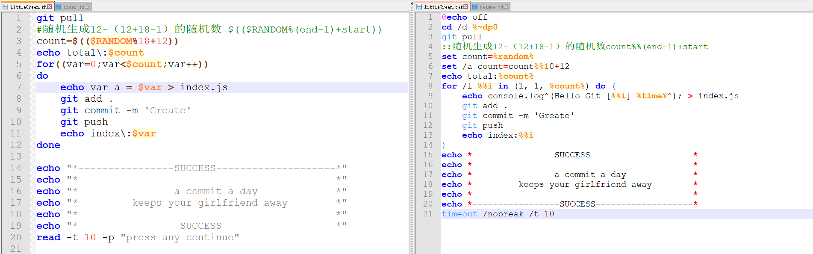
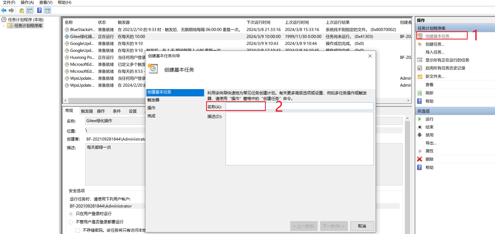
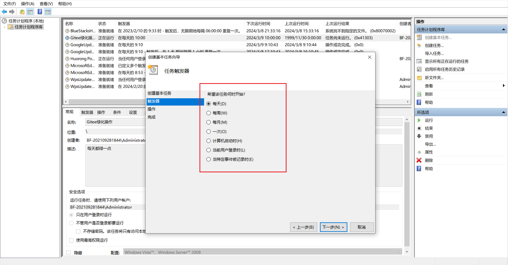
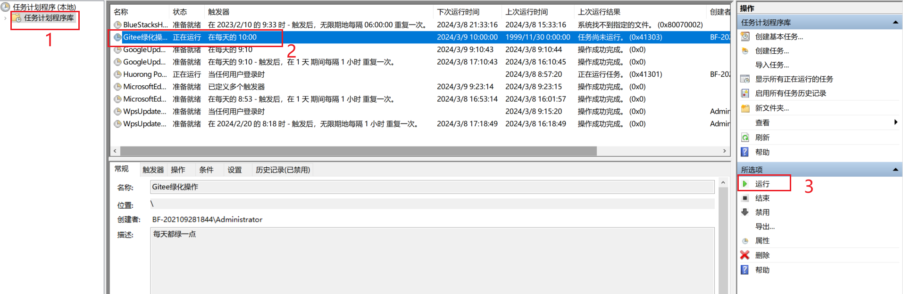
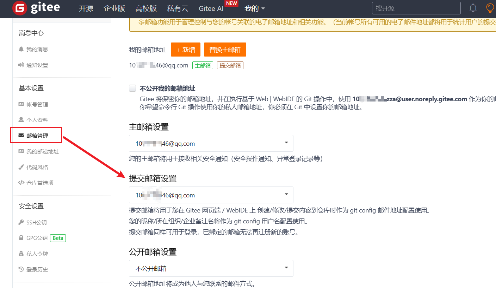

### Tips
可以将项目folk到自己的仓库，也可以将里面的littleGreen脚本放到自己的仓库里面，建议单独找个不用的仓库来进行绿化操作。
* `windows` 执行 `littleGreen.bat` 脚本，`Linux` 执行 `littleGreen.sh `脚本。
* `windows `建一个开机启动的脚本,里面，系统开机会执行下面的脚本。还可以再去window的定时计划里面去创建一个基本任务，频率设置成每天，相互补充。
* 也可以将项目clone到Linux，使用cron来定时执行 `littleGreen.sh` 脚本。

### windows的开机启动脚本
新建一个文本文档，将后缀改成bat格式，我这里命名为 `GreenHatLauncher.bat`，将脚本放在 `C:\ProgramData\Microsoft\Windows\Start Menu\Programs\Startup`路径下。

将开机启动脚本里面 `F:\Code\GreenHat\green-hat` 的路径内容替换成我们项目里面 `littleGreen.bat` 的路径。我们项目的路径不要有中文，以免出现各种问题。

```
cd /d F:\Code\GreenHat\green-hat
call littleGreen.bat
```

### 如何修改提交次数？
提交次数影响gitee展示的颜色深度，提交24次就是深绿色了。想展示得自然点，可以在脚本里面把这个数量换成随机数。

随机次数：



固定次数：

将脚本里面的count赋值为固定值，比如24？

### 如何在windows设置定时计划？

#### ① 命令添加

daily - 执行频率，每天
06:00 - 执行时间点

```
schtasks /create /tn "RunLittleGreen" /tr "C:\ProgramData\Microsoft\Windows\Start Menu\Programs\GreenHatLauncher.bat" /sc daily /st 06:00
```

#### ② 手动添加
win+R，执行taskschd.msc就可以弹出定时计划窗口了。


触发器的频率按照自己的需要设置。



点运行试试能不能正常提交到仓库。



### 提交了颜色未发生变化？
有提交记录，但是颜色没发生变化，请检查下本地电脑的git提交邮箱是否为gitee的账户提交邮箱。在项目文件夹下执行 `git config user.email` 检查下，不相同的话执行 `git config user.email 你的邮箱地址` 去修改当前项目的提交邮箱。`git config --global user.email` 是查看全局的git提交邮箱，我们就不去设置全局的邮箱了，只设置这个项目的。如果你要设置全局的提交邮箱，使用 `git config --global user.email 你的邮箱地址`。

当然，你也可以修改gitee的提交邮箱。
