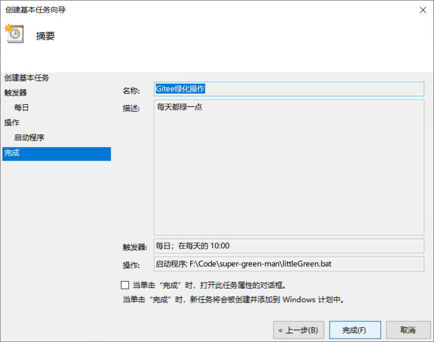

### 可以将项目folk到自己的仓库，然后拉到本地电脑，也可以将里面的littleGreen脚本放到自己的仓库里面，建议单独找个不用的仓库来进行绿化操作。
* windows执行littleGreen.bat或littleGreen.cmd脚本，Linux执行littleGreen.sh脚本。
* windows建议将脚本放到 C:\ProgramData\Microsoft\Windows\Start Menu\Programs\Startup 里面，系统开机会执行下面的脚本。
* 也可以将项目clone到linux，使用cron来定时执行littleGreen.sh脚本。

