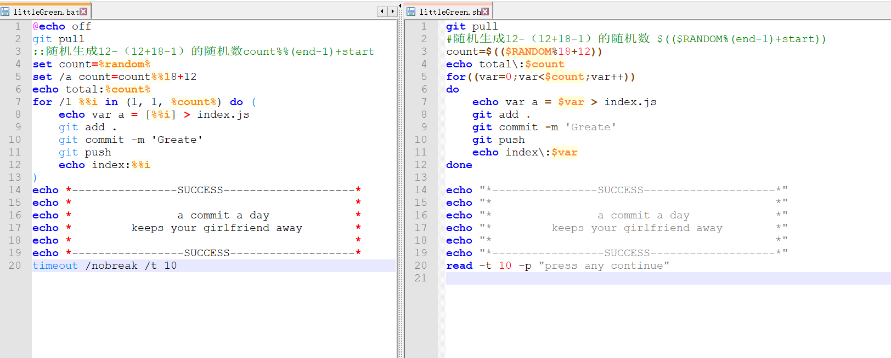

### Tips
可以将项目folk到自己的仓库，也可以将里面的littleGreen脚本放到自己的仓库里面，建议单独找个不用的仓库来进行绿化操作。
* `windows` 执行 `littleGreen.bat` 脚本，`Linux` 执行 `littleGreen.sh `脚本。
* `windows `建一个开机启动的脚本,里面，系统开机会执行下面的脚本。还可以再去window的定时计划里面去创建一个基本任务，频率设置成每天，相互补充。
* 也可以将项目clone到Linux，使用cron来定时执行 `littleGreen.sh` 脚本。

### windows的开机启动脚本

开机启动的脚本放在 `C:\ProgramData\Microsoft\Windows\Start Menu\Programs\Startup`路径。

根据自己的脚本路径去替换里面的内容。

```
start "Green Project Luncher" "F:\Code\super-green-man\littleGreen.bat"
```

### 如何修改提交次数？
提交次数影响gitee展示的颜色深度，提交24次就是深绿色了。想展示得自然点，可以在脚本里面把这个数量换成随机数。

固定次数：

随机次数：


### 如何在windows设置定时计划？
win+R，执行taskschd.msc就可以弹出定时计划窗口了。


触发器的频率按照自己的需要设置。


点运行试试能不能正常提交到仓库。

